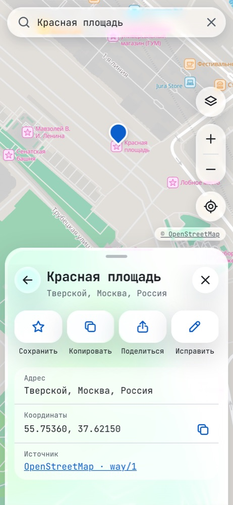
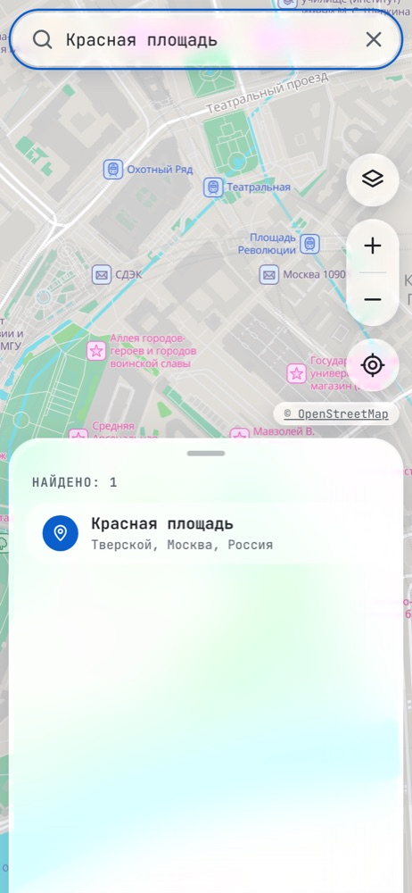
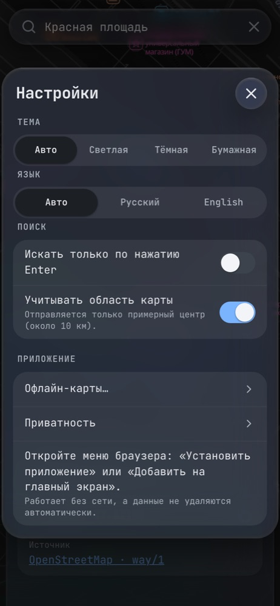
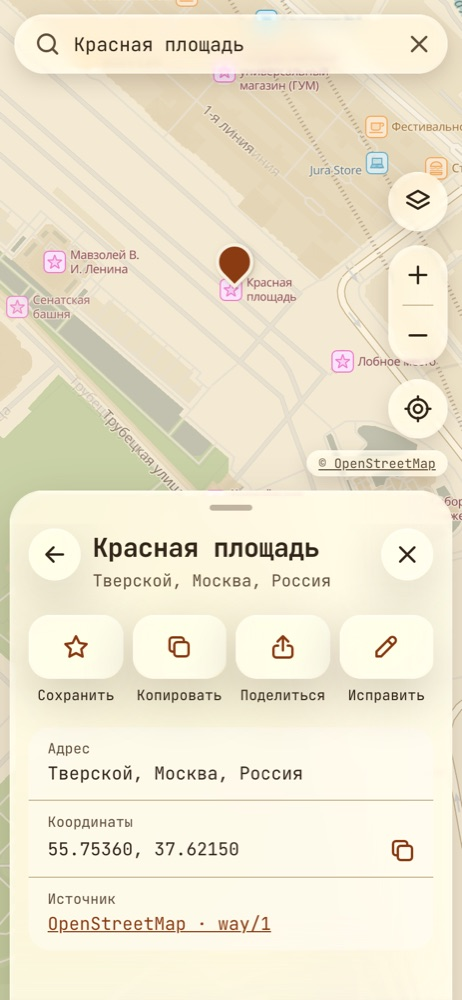

<div align="center">


# Veil

**A private map of the world.** No accounts, no cookies, no analytics, no tracking.

[](https://github.com/realfamousbae/Veil/actions/workflows/ci.yml)
[](LICENSE)
[](https://veil-239.pages.dev)

[**Open the map**](https://veil-239.pages.dev) · [Русский](README.md) · [Privacy](PRIVACY.md)

</div>

<p align="center">
  
  
  
  
</p>

## Features

- **A map of the whole world** from [OpenStreetMap](https://www.openstreetmap.org/) data — vector, fast, labels in English and Russian.
- **Search** for places and addresses, and "What's here?" on long-press or right-click.
- **Where am I** — only when you tap the button; your position never leaves the device.
- **Saved places** stay on the device; GeoJSON export/import is the backup instead of an account.
- **Offline maps** — download a region and use the map in airplane mode.
- **Installs as an app** on Android and iOS and works without a connection.
- **Themes** — light, dark and paper, with a Liquid Glass interface.
- **Open source**, and everything can run on your own server.

## Privacy

Veil is a static site with no backend of its own and no accounts. Its rules are a contract in
[PRIVACY.md](PRIVACY.md), enforced by an automated test on every change:

- no third-party requests on load — fonts, icons and map tiles come from the site's own origin;
- no cookies, `localStorage` or analytics; data stays on the device (IndexedDB, OPFS);
- geolocation only from the button, never sent anywhere — not to search, not into the URL;
- search goes out after 3 characters and a pause (or only on Enter); the map-area bias is rounded to ~10 km and can be turned off;
- a strict Content Security Policy allows connections only to the site and the search service.

**Honest limits.** Complete anonymity on the web does not exist: the server sees your IP and
which map areas you load (downloaded regions avoid that), and the search service sees your IP
and queries. Self-hosting removes third parties completely. The in-app **Settings → Privacy**
page explains this with the hosts of the current deployment.

## Security and liability

Report vulnerabilities and privacy leaks privately — see [SECURITY.md](SECURITY.md).

Veil is provided "as is" under the MIT License. **The authors and contributors are not
responsible** for how anyone deploys, configures, modifies or uses their own instances
(self-hosted servers, forks, mirrors), for the data such instances collect or process, or for
any actions their operators or users take. Whoever runs an instance is solely responsible for
it and for complying with the laws that apply to them.

## Install on a phone

- **Android (Chrome):** Settings → "Install Veil", or the browser menu → "Install app".
- **iPhone (Safari):** Share → "Add to Home Screen".

On iOS the installed app has storage separate from Safari: download offline regions inside it.
Saved places move over with export/import.

## How it works

| Part         | Technology                                                                                                 |
| ------------ | ---------------------------------------------------------------------------------------------------------- |
| UI           | [Svelte 5](https://svelte.dev/), TypeScript, Vite                                                          |
| Map          | [MapLibre GL JS](https://maplibre.org/), [Protomaps basemaps](https://github.com/protomaps/basemaps) style |
| Tiles        | [PMTiles](https://github.com/protomaps/PMTiles): the world up to zoom 7 + detailed regions up to zoom 15   |
| Search       | [Photon](https://github.com/komoot/photon)                                                                 |
| Offline      | Service Worker (Workbox), regions in OPFS                                                                  |
| Demo hosting | Cloudflare Pages + R2; tiles served by a Pages Function on the same origin                                 |

The demo covers the whole world at overview zooms and **Moscow and Moscow Oblast** in detail.

## Development

Requirements: Node 22+, pnpm 10 and the [`pmtiles`](https://github.com/protomaps/go-pmtiles) CLI (`brew install pmtiles`).

```bash
pnpm install
# Small map samples for development (~27 MB, read over HTTP from the latest planet build):
scripts/build-regions.sh --out public/dev --maxzoom 5 world
scripts/build-regions.sh --out public/dev moscow-center
pnpm dev
```

`pnpm check`, `pnpm lint`, `pnpm test`, `pnpm test:e2e` (including the privacy test) and
`pnpm budget` must pass before a pull request — see [CONTRIBUTING.md](CONTRIBUTING.md).

The runtime `public/config.json` points at the map files and the geocoder, so a deployment can
change them without rebuilding. The site address for link previews is set in `.env`
(`VITE_SITE_URL`).

## Running your own instance

Your own instance removes third parties entirely: both the map and search run on your server.
The full step-by-step guide (build, cutting map files, your own Photon search, `config.json`,
nginx with security headers, checks) is in the
[Russian README](README.md#развёртка-собственного-сервиса). In short:

```bash
git clone https://github.com/realfamousbae/Veil.git && cd Veil && pnpm install && pnpm build
scripts/build-regions.sh --out /srv/veil/tiles world          # planet overview, ~190 MB
scripts/build-regions.sh --out /srv/veil/tiles moscow-oblast  # or your region from scripts/regions.tsv
java -Xmx8G -jar photon-1.3.0.jar serve -listen-ip 127.0.0.1  # optional: your own search
```

Serve `dist/` and the `.pmtiles` files over HTTPS with any web server that supports HTTP Range
requests, proxy Photon at `/geo/`, set `"geocoder": { "url": "/geo" }` in `dist/config.json`
and copy the CSP from `dist/_headers` (`node scripts/build-headers.mjs`) into your server
config. See also the [liability section](#security-and-liability).

## Credits

- Map data © [OpenStreetMap contributors](https://www.openstreetmap.org/copyright), ODbL.
- Basemap style and builds by [Protomaps](https://protomaps.com/) (BSD-3-Clause), rendering by [MapLibre](https://maplibre.org/).
- Search by [Photon](https://github.com/komoot/photon) from komoot.
- Liquid Glass–style design after [liquid-glass-svelte](https://github.com/Tozaburo/liquid-glass-svelte) (Tozaburo, MIT).
- Fonts: [JetBrains Mono](https://www.jetbrains.com/lp/mono/) and Noto Sans (SIL OFL).

## License

Code: [MIT](LICENSE).
